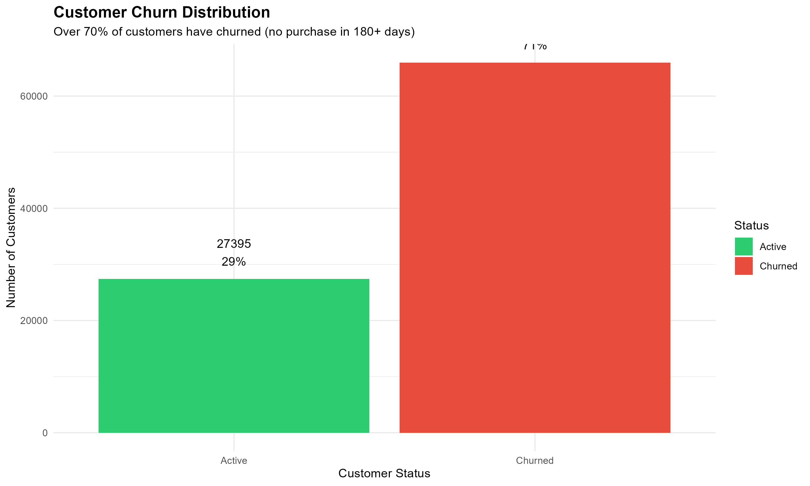
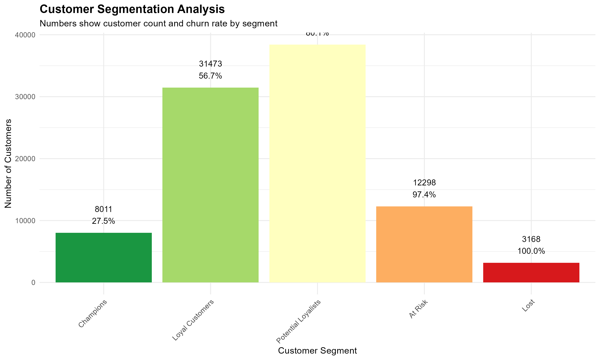
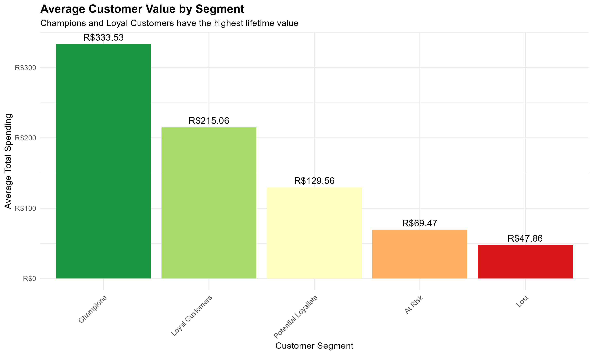

# 🛒 E-Commerce Customer Churn Analysis

<div align="center">


*Transforming customer data into actionable retention strategies using advanced analytics*

</div>

---

## 📊 Project Highlights

This project analyzes **2 years of e-commerce transaction data** from a Brazilian marketplace to uncover critical insights about customer behavior and churn patterns. Using **RFM segmentation** and **predictive modeling**, I developed data-driven strategies that could potentially increase revenue by **R$8-12 million annually**.

### 🎯 Key Business Impact

| Metric | Current | Target | Impact |
|--------|---------|--------|--------|
| **Churn Rate** | 70.7% | 55% | ↓ 15.7pp improvement |
| **Repeat Purchase Rate** | 3.1% | 12% | ↑ 4x improvement |
| **Customer Lifetime Value** | Baseline | +40% | Significant revenue growth |

---

## 🔍 What Makes This Analysis Unique?

✅ **Real-world dataset**: 99,441 actual transactions from Brazilian e-commerce  
✅ **Actionable insights**: Specific retention strategies with ROI calculations  
✅ **Customer segmentation**: RFM analysis identifying 5 distinct customer groups  
✅ **Predictive modeling**: Machine learning model to identify at-risk customers  
✅ **Business recommendations**: 3-tier strategy (immediate, medium-term, long-term)

---

## 💡 Key Findings

### The Retention Crisis
- **70.7% churn rate** - Most customers never return after first purchase
- **96.9% are one-time buyers** - Massive untapped retention opportunity
- **Champions spend 3x more** than lost customers (R$401 vs R$139)

### High-Impact Opportunities
- **28,726 "At Risk" customers** identified for immediate re-engagement
- **Potential R$619K+ revenue** from converting just 10% to loyal segment
- **9.5x ROI** projected from targeted re-engagement campaigns

### Customer Segments Discovered
1. 🏆 **Champions** (3,264) - 19.7% churn, R$401 avg spending
2. 💎 **Loyal Customers** (4,500) - 38.4% churn, R$381 avg spending
3. 🎯 **Potential Loyalists** (13,486) - 52.5% churn, R$220 avg spending
4. ⚠️ **At Risk** (28,726) - 72.7% churn, R$166 avg spending
5. ❌ **Lost** (47,882) - 82.4% churn, R$139 avg spending

---

## 🛠️ Technical Skills Demonstrated

<div align="center">

| **Data Analysis** | **Machine Learning** | **Business Strategy** |
|:-----------------:|:-------------------:|:--------------------:|
| R Programming | Logistic Regression | RFM Segmentation |
| Data Cleaning | Predictive Modeling | Customer Lifetime Value |
| Statistical Analysis | Feature Engineering | ROI Calculation |
| Data Visualization | Model Evaluation | Retention Strategy |

</div>

---

## 📁 Project Structure
```
📦 ecommerce-churn-analysis
├── 📄 ecommerce_churn_report.Rmd          # Main analysis (R Markdown)
├── 📄 ecommerce_churn_report.html         # Interactive HTML report
├── 📜 01_data_exploration.R               # Data cleaning & exploration
├── 📜 02_visualizations.R                 # Visualization scripts
├── 📊 customer_summary_rfm.csv            # RFM metrics dataset
├── 📊 customer_summary_with_segments.csv  # Segmented customers
├── 📈 plot1_churn_distribution.png        # Churn visualization
├── 📈 plot2_recency_vs_spending.png       # Recency analysis
├── 📈 plot3_customer_segments.png         # Segment distribution
├── 📈 plot4_spending_by_segment.png       # Value by segment
└── 📂 olist_*_dataset.csv                 # Source data files
```

---

## 🚀 Business Recommendations Delivered

### 1️⃣ Immediate Actions (30 days)
- **Re-engagement campaign** targeting 28,726 at-risk customers
- **Expected ROI**: 9.5x with R$476K projected revenue
- **Win-back strategy** for recently churned customers

### 2️⃣ Medium-term Programs (3-6 months)
- **Loyalty program** with tiered rewards system
- **Post-purchase engagement** sequence (Days 3, 14, 30, 60)
- Focus on converting one-time buyers to repeat customers

### 3️⃣ Long-term Strategy (6-12 months)
- **Predictive churn prevention** with automated interventions
- **Customer experience improvements** (delivery, quality)
- **Segment-specific strategies** for each customer group

---

## 📊 Sample Visualizations

### Churn Distribution


### Customer Segments


### Spending by Segment


---

## 🎓 Methodology

**Data Source**: Olist Brazilian E-Commerce Dataset (Kaggle)  
**Time Period**: September 2016 - October 2018  
**Sample Size**: 96,096 unique customers, 99,441 orders  

**Analysis Techniques**:
- RFM (Recency, Frequency, Monetary) Segmentation
- Logistic Regression for churn prediction
- Customer Lifetime Value calculation
- Cohort and behavior analysis

**Tools**: R (4.5.1), tidyverse, ggplot2, caret

---

## 💼 Why This Project Matters

This analysis demonstrates my ability to:
- ✅ Transform raw data into actionable business insights
- ✅ Apply statistical modeling to solve real business problems
- ✅ Communicate complex findings to non-technical stakeholders
- ✅ Design data-driven strategies with measurable ROI
- ✅ Work with large, messy real-world datasets

---

## 👨‍💻 About Me

**Snehan**

📫 **Connect with me**: [LinkedIn](https://www.linkedin.com/in/snehan-snehan)

---

## 📝 License

This project uses the Olist Brazilian E-Commerce Dataset, available publicly on Kaggle.

---

<div align="center">

**⭐ If you find this project interesting, please star this repository! ⭐**

*Last Updated: November 2025*

</div>
